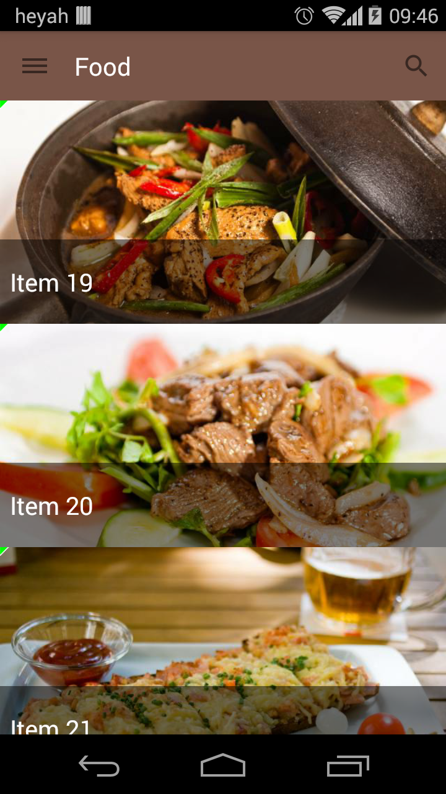
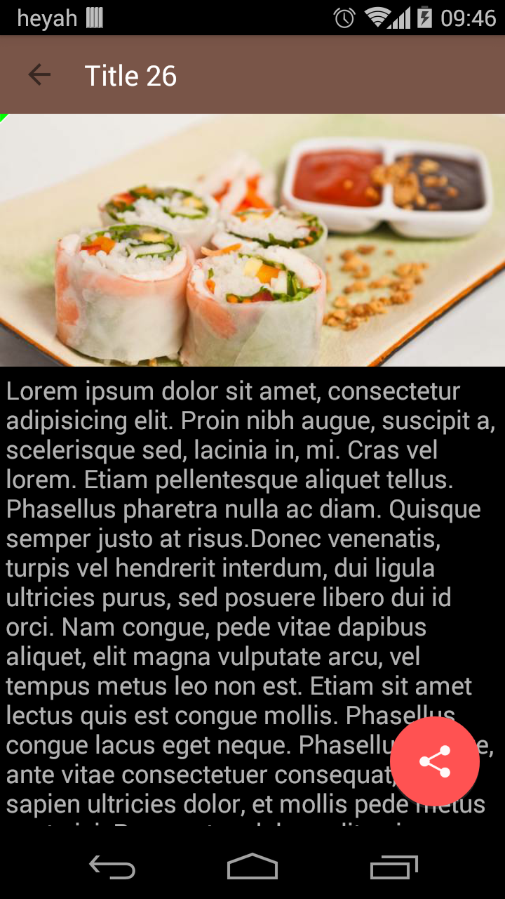
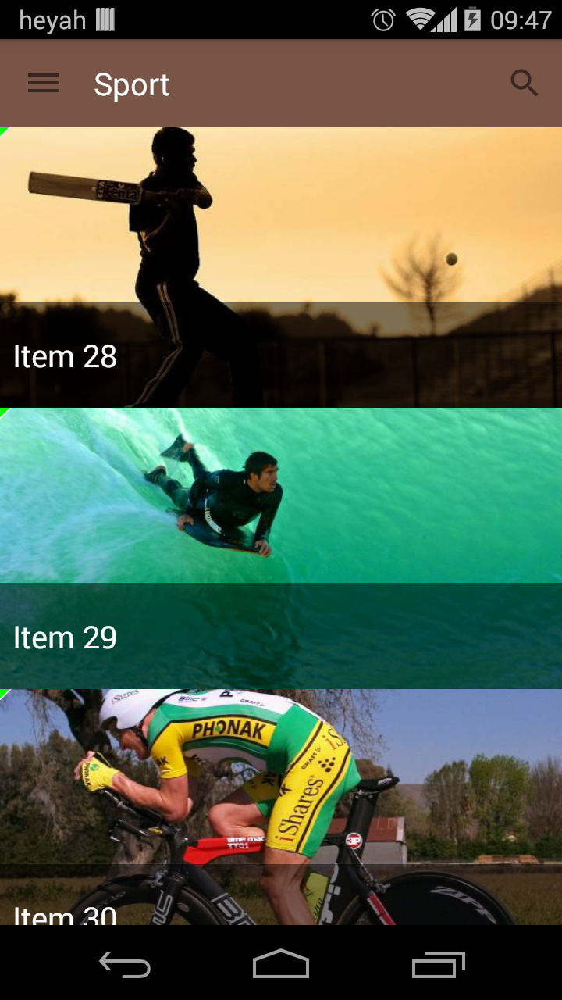

# BaseProject





```java
    private void loadAlbum() {
        refreshLayout.setRefreshing(true);
        retrofitSubscription = AppObservable.bindFragment(this, Service.getInstance(getActivity())
                .getNewClientInstance().getAlbum(getArguments().getString(ALBUM_NAME_KEY).toLowerCase())
                .doOnNext(album -> DatabaseManager.getInstance(getActivity().getApplicationContext())
                        .saveAlbum(album))
                .subscribeOn(Schedulers.io()))
                .subscribe(album -> {
                            mAdapter.setAlbum(album);
                            mAdapter.notifyDataSetChanged();
                        },
                        exception -> {
                            exception.printStackTrace();
                            refreshLayout.setRefreshing(false);
                        }, () -> refreshLayout.setRefreshing(false));
    }
```

License
===========================
Apache License 2.0